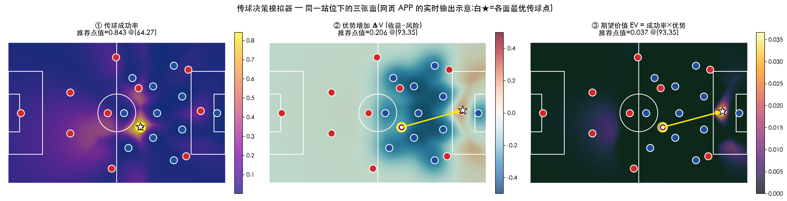

# 传球决策模拟器 · Pass Advisor

给定某一瞬间双方球员的**静态站位**,估计"球传到球场每一点"的两个量,并给出综合推荐:

1. **传球成功率** —— 能不能传到那里
2. **优势增加 ΔV(收益 − 风险)** —— 传成之后对己方有多划算
3. **期望价值 EV = 成功率 × 优势** —— 综合"传得成"与"传成后划算"

对应研究课题:*在某个瞬间双方阵型固定时,球传到哪个位置最好。*



---

## 快速开始

双击 `pass_advisor.html`,用任意现代浏览器打开即可。**零依赖、离线可用。**

无需安装 Python 或任何库;模型与界面全部在这一个 HTML 文件里。

---

## 使用说明

### 摆站位

- **拖动**任意红/蓝圆点移动球员;支持手机触摸。
- **阵型预设**:右侧"阵型预设"面板可为红队/蓝队分别一键重摆经典阵型
  (4-3-3、4-4-2、4-3-1-2、4-2-3-1、4-1-4-1、5-3-2、5-4-1)。
  红队向右进攻,蓝队自动镜像;选择后另一队不动,仍可继续拖动微调。
- "重置站位"按钮恢复初始示例场景。

### 球员编号

- 每个球员圆点上显示球衣号码,默认两队均为 1–11。
- **单击**任一球员选中(黄框高亮),在"选中球员"面板输入框修改编号(1–99)。

### 确定"从谁传出"(持球者 = 黄圈)

三种方式任选:

1. **双击**某红队球员 → 直接设为持球者;
2. 单击选中红队球员后,点"设为持球者"按钮;
3. 把球(黄圈)**拖到**某红队球员 ≤2.5 m 处放开 → 自动设为持球者。

也可点"设持球者=最近红队"按钮。

### 确定"传到哪里"(目标 = 星标)

- **自动模式(默认)**:程序在 84×54 网格上评估当前选中的面,白色 ★ 自动标出最大值点,黄色箭头从持球者指过去。切换顶部三个面(成功率 / 优势 / EV),★ 会随之移动。
- **自定义模式**:**单击球场任意空白处**,即把传球目标钉在该点(青色 ◎ 星 + 虚线箭头),右侧面板显示该点数值;点"清除自定义目标"恢复自动 ★。

### 查看数值与调参

- 鼠标悬停任意位置,右侧实时显示该点的 成功率 P / 收益 / 风险 / 优势 ΔV / 期望价值 EV。
- 三个参数滑块:λ(风险权重,越大越保守)、拦截敏感度、控球软硬度。

---

## 文件结构

```
pass_advisor/
├── pass_advisor.html      # 主程序(单文件网页,模型 + 界面都在里面)
├── README.md              # 本文件
├── LICENSE                # MIT
└── figures/
    ├── app_preview.png    # APP 三面输出预览
    ├── fig1_soccermap.png # 文献示意①:SoccerMap 传球概率面 + 5×5 最优点
    ├── fig2_unet_epv.png  # 文献示意②:U-Net EPV 收益/风险/净值三联图
    └── fig3_obpv.png      # 文献示意③:OBSO vs OBPV 全场空间价值对比
```

---

## 模型逻辑(当前版本)

坐标系:球场 105 × 68 m,红队持球向右(x 增大方向)进攻,进攻目标球门在 (105, 34)。

- **传球成功率** = 控球概率 × 线路开阔度 × 距离衰减
  - 控球概率:己方/对方到目标点最近距离之差经 sigmoid(类似软 Voronoi)
  - 线路开阔度:防守球员到"持球者→目标点"线段的最近垂距经 sigmoid(越近越易被断)
  - 距离衰减:exp(−距离/26)
- **收益 Reward** = 控球概率 × 靠近球门程度(exp(−到球门距离/20),并对中路加权)
- **风险 Risk** = 目标点周围防守球员的高斯密度 ×(越靠前场越高)
- **优势增加 ΔV** = 收益 − λ × 风险(λ 默认 0.85)
- **期望价值 EV** = 成功率 × max(0, 优势)

> ⚠️ **模型性质**:当前公式是**教学示意用的解析近似**——框架遵循下述文献,但系数是手调的,**不是用真实追踪数据训练得到的**。适合演示思路、快速试站位、当交互原型;若要做严肃分析,需用真实数据标定(见"下一步")。

---

## 文献基础

| # | 论文 | 核心贡献 | 本项目对应 |
|---|------|---------|-----------|
| ① | **SoccerMap** (Fernández & Bornn 2020) | 为全场每个位置预测"传球成功概率面";在队友预期跑位周围 5×5 网格搜最优传球点 | 成功率面 + 网格搜索最优点 |
| ② | **U-Net EPV / OJN-Pass-EPV 基准** (Overmeer, Janssen & Nuijten 2025) | 把每个传球目标点的价值拆成"收益 vs 风险";评估窗口 15 秒;新增"球的高度"特征;提出首个 EPV 基准 | 优势增加 ΔV = 收益 − λ×风险 |
| ③ | **OBPV** (Ogawa, Umemoto & Fujii 2025) | 将只擅长评估球门附近的 OBSO 扩展为"全场空间价值",尤其适合评估攻防转换区域 | 全场(而非仅禁区)评估思路 |
| ④ | **Physics-Based Pass Probabilities** (Spearman et al. 2017) | 用物理运动模型估计传球成功概率;本项目成功率公式的"控球概率 + 线路拦截"结构与此一脉相承 | 成功率公式结构 |
| ⑤ | **OBSO / Beyond Expected Goals** (Spearman 2018) | 提出 Off-Ball Scoring Opportunity,pitch control × 空间价值的经典框架 | 软 Voronoi 控球概率 |

### 引用格式

```
[1] Fernández, J., & Bornn, L. (2020). SoccerMap: A Deep Learning Architecture
    for Visually-Interpretable Analysis in Soccer. ECML-PKDD 2020.
    arXiv:2010.10202.

[2] Overmeer, P., Janssen, T., & Nuijten, W. (2025). Revisiting Expected
    Possession Value in Football: Introducing a Benchmark, U-Net Architecture,
    and Reward and Risk for Passes. arXiv:2502.02565.

[3] Ogawa, R., Umemoto, R., & Fujii, K. (2025). Pitch-wide Space Evaluation
    for Transitions in Soccer (OBPV). arXiv:2505.14711.

[4] Spearman, W., Basye, A., Dick, G., Hotovy, R., & Pop, P. (2017).
    Physics-Based Modeling of Pass Probabilities in Soccer.
    MIT Sloan Sports Analytics Conference 2017.

[5] Spearman, W. (2018). Beyond Expected Goals.
    MIT Sloan Sports Analytics Conference 2018.
```

> 文献①②③的方法细节(SoccerMap 的 5×5 网格最优点搜索、U-Net EPV 的收益/风险拆解与 OJN-Pass-EPV 基准、OBPV 对 OBSO 的全场扩展)均已在本项目开发过程中核对原文 PDF 确认。

---

## 下一步(按投入从小到大)

1. **加"传给谁"模式**:只在 11 名队友(而非全场每点)上评估,更贴近实战决策与 SoccerMap 原始设定。
2. **加入球员速度**:当前为纯静态位置。加速度向量后,用"下一秒预期位置"纳入成功率(pitch control 的核心),更接近实战。
3. **接真实数据标定**:有事件数据(传球成功/失败)或 StatsBomb 360 冻结帧时,用逻辑回归把公式系数拟合到真实成功率,让数字有据可依。
4. **迁到 Python 后端**:若要接训练好的深度模型(SoccerMap / U-Net EPV),再考虑 Streamlit / Dash。

---

## License

MIT — 见 [LICENSE](LICENSE)。
